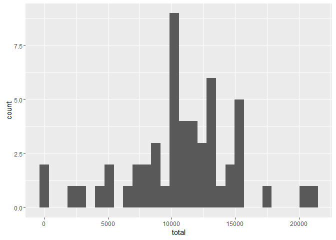
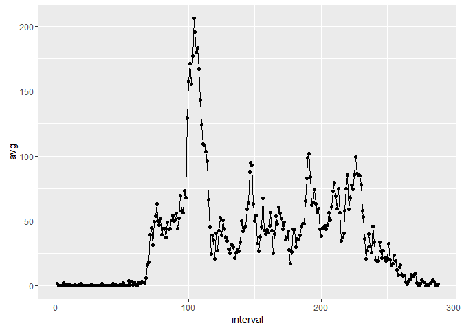
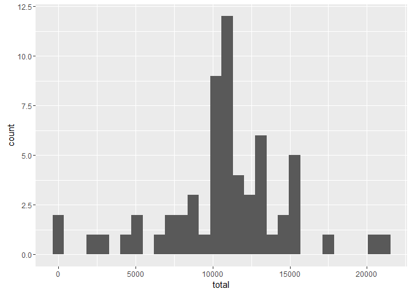
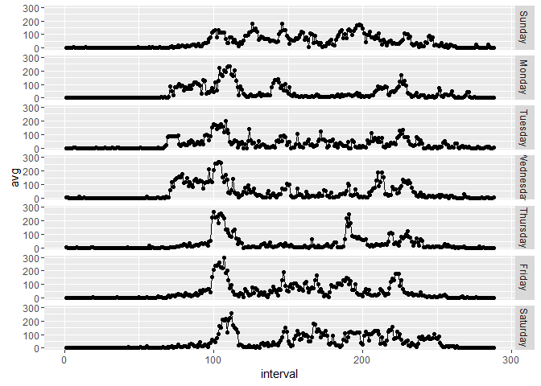

# Reproducible Research: Peer Assessment 1
Ryan Porter  


## Loading and preprocessing the data

First I unzipped the data (using winRAR) into the repo. Next I loaded the data in using. I also loaded in the dplyr and ggplot2 packages

```r
library(dplyr)
```

```
## 
## Attaching package: 'dplyr'
```

```
## The following objects are masked from 'package:stats':
## 
##     filter, lag
```

```
## The following objects are masked from 'package:base':
## 
##     intersect, setdiff, setequal, union
```

```r
library(ggplot2)
data <- read.csv("activity.csv")
data <- mutate(data, date = as.Date(date), interval = as.numeric(as.factor(interval)))
```
I converted the date to date format and changed interval to a list of consecutive numbers to remove the jump from 60 to 100 at the end of every hour.

## What is mean total number of steps taken per day?

To see the total steps per day I created a histogram of it and then calculated the mean after so I could see both the values across the data set and the specific metric of the mean.


```r
by_day <- group_by(data, date)
total_by_day <- summarise(by_day, total = sum(steps))
graph1 <- ggplot(total_by_day, aes(total))
graph1 + geom_histogram(bins = 30)
```

```
## Warning: Removed 8 rows containing non-finite values (stat_bin).
```



```r
#calculate the mean total steps per day.
avg1 <- mean(total_by_day$total, na.rm = TRUE)
#calculate the median total steps per day.
med1 <- median(total_by_day$total, na.rm = TRUE)
```
The mean total steps per day is 1.0766189\times 10^{4} and the median is 10765.

## What is the average daily activity pattern?


```r
by_interval <- group_by(data, interval)
avg_by_interval <- summarise(by_interval, avg = mean(steps, na.rm = TRUE))
graph2 <- ggplot(avg_by_interval, aes(interval, avg))
graph2 + geom_point() + geom_line()
```



```r
maxint <- filter(avg_by_interval, avg == max(avg))
```
The interval that has the highest mean steps is the 104th 5 minute interval. (which corisponds to 835 in the original format)


## Imputing missing values

I did a simple imputation using the mean of each interval to fill in missing days, after I made sure that the data was missing in complete days. 

```r
# making sure that it is missing full days:

test <- is.na(data$steps)

sum(test) %% 288 == 0 # 288 is the number of 5 min intervals in a day
```

```
## [1] TRUE
```

```r
sum(test) / 288 # calculating the number of days
```

```
## [1] 8
```

```r
# imputing using the previous step of calculating the average per each interval copying that into the holes
# to finish the code.

steps_imp <- avg_by_interval$avg
data$ID <- seq.int(nrow(data))
data_na <- data[is.na(data$steps),]

#calculate ranges to impute data over.
lower <- c()
upper <- c()

for (i in 1:8){
    lower <- c(lower, data_na[(i-1) * 288 + 1, 4])
    upper <- c(upper, data_na[i * 288,4])
    }

na_ranges <- data.frame(lower=lower, upper=upper)

for (i in 1:8){
    # replace each section of the data frame with the imputed data. which is the average per interval data
    data[na_ranges[i,1]:na_ranges[i,2],1] <- avg_by_interval$avg
}
```

Histogram of the total number of steps taken each day after missing values are imputed


```r
by_day <- group_by(data, date)
total_by_day <- summarise(by_day, total = sum(steps))
graph3 <- ggplot(total_by_day, aes(total))
graph3 + geom_histogram(bins = 30)
```



```r
avg2 <- mean(total_by_day$total)
med2 <- median(total_by_day$total)
```
The mean total steps per day in the imputed data is 1.0766189\times 10^{4} and the median is 1.0766189\times 10^{4}.

The difference in the means of the original data and the imputed data is 0, and the difference between the median is -1.1886792. Which h would make sence as I added more data at the mean of the data set which would shift the median a little bit. The peak of the histogram of the total steps per day is also much larger.

## Are there differences in activity patterns between weekdays and weekends?

```r
data_days <- mutate(data, day = weekdays(as.Date(date))) %>%
    group_by(day, interval) %>%
    summarise(avg = mean(steps))

data_days$day <- factor(data_days$day, levels= c("Sunday", "Monday", 
    "Tuesday", "Wednesday", "Thursday", "Friday", "Saturday"))

#daily[order(daily$DoW), ]
graph5 <- ggplot(data_days, aes(interval, avg))
graph5 + geom_point() + geom_line() + facet_grid(day~.) 
```


By the looks of the plot the general differences between weekends and weekdays are that weekday activity seems to start a bit earlier than the weekend activity, and the weekend activity has more activity through the middle of the day.
